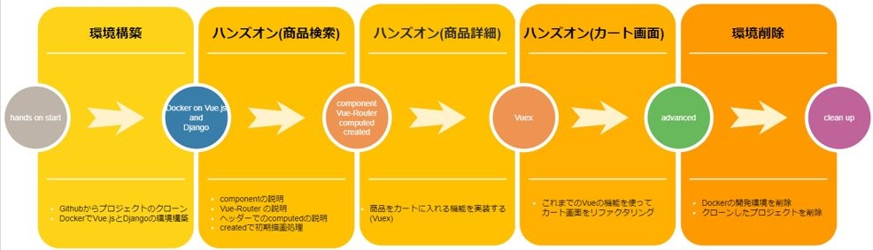

# mirameet vol.31_エグゼコム　現場で役立つ実践Vue.js!～ECサイトを作成してみる～

## 事前準備
- VSCodeインストール
- Dockerインストール

## 今回の流れ
以下内容についてハンズオンしていきます。
- 商品検索の共通ヘッダーを実装してみる（component）
- 商品検索画面の初期表示処理を実装してみる（created, mounted）
- 商品をカートに入れる機能を実装する（VueX）
- 商品の合計金額を自動で算出する（computed）

## 手順

- 環境構築①：デモアプリクローン
- 環境構築②：デモアプリの起動、動作確認
- アプリケーションコード修正（商品検索画面）
- アプリケーションコード修正（商品詳細画面）
- アプリケーションコード修正（カート画面）
- 作成したコンテナの削除