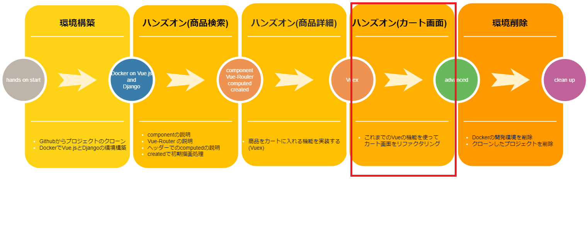

# Vue.jsの機能を活用してコードの修正をしてみよう 回答編  

  

## 修正対象のソース
* client/ecsite/src/views/Cart.vue

それでは答え合わせしてみましょう！  
今回使用するVue.jsの機能は「computed」になります！皆さん予想はどうでしたでしょうか？  
Vue.jsの機能を把握していないと難しいですよね？早速ですが「computed」を使って画面の修正を行ってみましょう！

## Vueの機能を使ってソースコードの修正 
mounted と handleDelete method から合計値取得処理を削除して、getTotal method を computed内に書き換えます。

* 修正前
```javascript
    mounted: function () {
        // DOMのマウント終了後の処理
        /** 合計値取得処理 */
        this.totalPrice = this.getTotal()
    },

    methods: {
        ...

        /**
         * 削除ボタン押下
         */
        handleDelete (index) {
            // storeから該当商品を削除
            this.$store.commit('deleteItem', index)
            /** 合計値取得処理 */
            this.totalPrice = this.getTotal()
        },
        /**
         *合計値取得
        */
        getTotal () {
            let price = 0
            this.getItemList.forEach(element => {
                price += element.price * element.quantity
            })
            return price
        },
    }
```

* 修正後
```javascript
    mounted: function () {
        // DOMのマウント終了後の処理
    },

    methods: {
        /**
         * 削除ボタン押下
         */
        handleDelete (index) {
            // storeから該当商品を削除
            this.$store.commit('deleteItem', index)
        },
    },

    computed: {
        getTotal () {
        let price = 0
        this.getItemList.forEach(element => {
            price += element.price * element.quantity
        })
        return price
        }
    },
```

dataに定義していた totalPrice も削除。templateタグ内で合計額表示している箇所を computed に定義した getTotal に書き換えます。

* 修正前

```html
<b-card-group>
    <b-card
    title="合計金額"
    style="max-width: 20rem;"
    >
    <b-card-text>￥{{ totalPrice | money }}円</b-card-text>
    <b-button
        variant="primary"
        @click.stop="handleSubmit"
        :disabled="getItemList.length === 0"
    >
        商品を購入
    </b-button>
    </b-card>
</b-card-group>
```

* 修正後

```html
<b-card-group>
    <b-card
    title="合計金額"
    style="max-width: 20rem;"
    >
    <b-card-text>￥{{ getTotal | money }}円</b-card-text>
    <b-button
        variant="primary"
        @click.stop="handleSubmit"
        :disabled="getItemList.length === 0"
    >
        商品を購入
    </b-button>
    </b-card>
</b-card-group>
```
## 修正内容の確認  
ブラウザをリロードしてみて表示されている内容に問題がないか確認してみましょう。  
ソースコード上ではVueの機能を使うことでロジックがまとまり、保守の観点でも修正箇所が減って可読性も上がりました。  
画面上では修正前と同じく商品の削除ボタンが押下されたたびに合計額が動的に変化するのが確認できると思います。