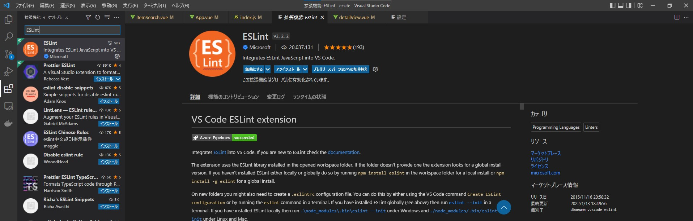
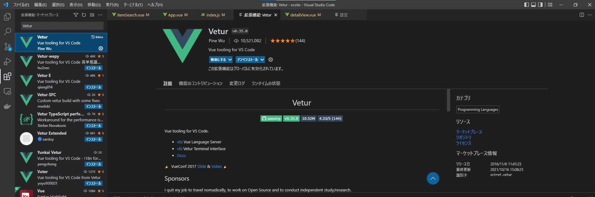
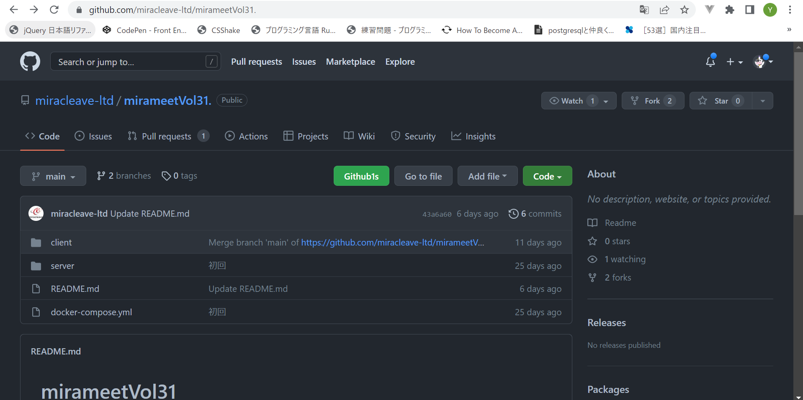
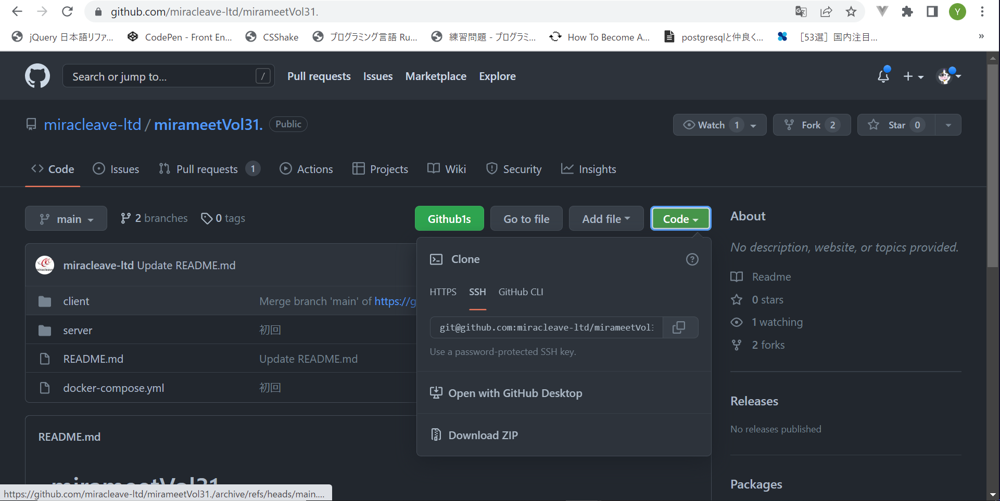
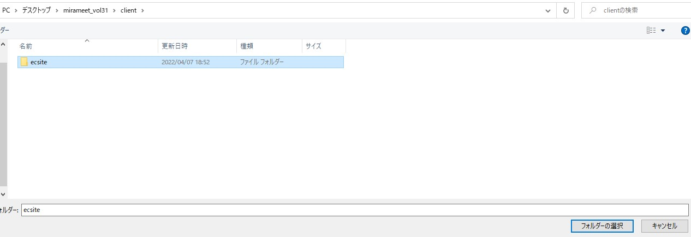

# 環境構築 その１ Django APIサーバーをDocker環境で準備

はじめに今回のハンズオンの環境構築を行いたいと思います。  
まずは、Vueの環境を立てる前にサーバーサイドとして使用する  
Djangoフレームワークを用いてAPIサーバーを準備します。


## 1. vscodeの拡張機能の確認  
vscodeの拡張機能で、「ESLint」「Vetur」が入っているか確認してください。  
<br/>
1-1.
拡張機能を開く  
  
<br/>
1-2.  
「ESLint」「Vetur」をインストールされているか確認する。まだの場合はインストールする。  
*ESLint* :保存時に自動フォーマットしたり、コードの構文チェックをしてくれる。
  
<br/>
*Vetur* :vue.jsでシンタックスハイライトしてくれる。vscodeでvue.jsを扱うならほぼ必須。  
  
<br/>
インストールした場合は、vscodeを一度閉じて、再起動してください。

## 2. githubリポジトリにアクセス  
2-1.
以下リンクよりデモアプリのあるGithubリポジトリにアクセスします。  
URL:https://github.com/miracleave-ltd/mirameetVol31-Vue.js



## 3. ソースコードダウンロード  
3-1.  
Codeボタンより、Zipファイルをダウンロードします。


## 4. ソースコード展開  
4-1.  
ダウンロードしたZipファイルを任意のフォルダに展開してください。  
※次の手順を進めるに当たり、展開されたフォルダをVSCodeで開くようお願いします。  
ファイル フォルダーを開く  
  
<br/>
client > ecsiteを選択して開く  


## 5. サーバーの起動  
一度ローカルでサーバーを立ち上げましょう。  
5-1. Docker Desktopの起動確認  
docker Desktopが起動できていることを確認します
  
5-2. Dockerのbuildと起動の確認  
コマンドをVSCodeのターミナル上から実施し、Dockerの起動を行います。  
ターミナル > 新しいターミナル  
  
以下コマンドでdocker-compose.ymlがあるフォルダに階層を移動します。
```
cd ../../
```
以下コマンドを実行し、コンテナをビルドします。
```
docker-compose up -d --build
```
dockerが起動しているか以下のコマンドで確認してみましょう。
```
docker-compose ps
              Name                            Command               State           Ports
--------------------------------------------------------------------------------------------------
mirameet_vol30_20220314_client_1   docker-entrypoint.sh node        Up      0.0.0.0:8080->8080/tcp
mirameet_vol30_20220314_server_1   python manage.py runserver ...   Up      0.0.0.0:8040->8000/tcp
```
state が Up となっていれば問題ありません。  
  
