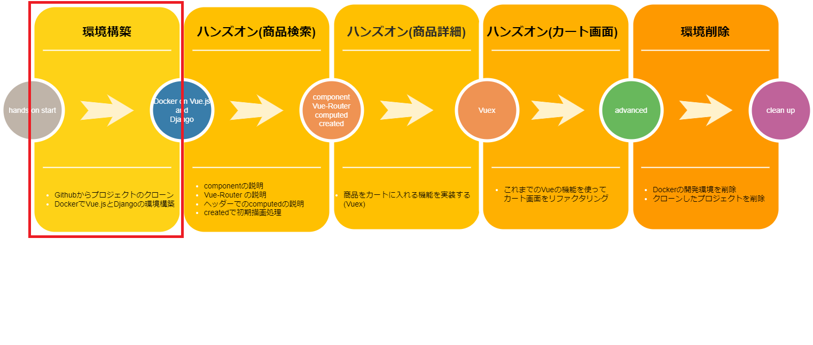

# 環境構築 その2 Vue アプリケーションをDocker環境で準備

続いてVueアプリケーションの準備に移ります。  



ecsiteディレクトリ直下をvscodeで開いていることを確認してください。vscodeが正常に動作しないことがあります。  
以下がecsiteディレクトリになります。
```
mirameetVol31.-main/client/ecsite  
```

1. Dockerコンテナに入ってnpm installを実行  
Vueプロジェクトに必要なパッケージをインストールするためにまずは下記のコマンドでDockerコンテナに入ります。
```
docker-compose exec client sh
```
Dockerコンテナ内に入ったらnpmでvue/cliをインストールします。  
ターミナル上に /usr/src と表示されていればコンテナに入れています。
```
npm install -g @vue/cli
```
続いて、以下コマンドでnode_modulesフォルダ上に必要なパッケージ類がインストールされます。   
(通信環境によってしばらく時間がかかります。)  

```
npm install
```

2. Vueアプリケーションサーバーをたてる  
npmでパッケージインストールが完了したら引き続きDocker内で  
以下コマンドでVueアプリケーションを立てましょう。ビルドには少々時間がかかります。
```
npm run serve
```
以下の表示になったら起動完了です。


3. ブラウザから起動確認をしましょう。  
2 の実装が完了したら以下のURLでブラウザ上から起動の確認を行ってください。  
url: http://localhost:8080  
