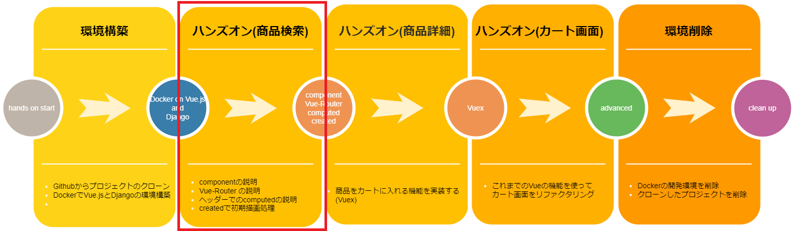

# コード修正(ヘッダー)

当手順では、以下の赤枠部分を実施します。


## 修正対象のソース

- **src\components\Header.vue**

修正する前に一度、状況を確認してみましょう。  
 http://localhost:8080/

「大分類」から、何か選択した状態で「中分類」のリストをクリックしてみてください。  
 

特にフィルタリング処理は実装されておらず、大分類を変更しても  
中分類リストの選択肢一覧に変更がないことが分かったかと思います。

## computed のおさらい

computed についておさらいします。  
 業務において、データに何かしらの処理を加えてから表示させたい。という場面があると思います。  
 そんな時に使えるのが computed プロパティです。  
 computed は一度計算後、同じ処理が呼び出された際も以前計算時に  
 キャッシュされたデータを即時返すだけなので何度も同じ処理を行いません。  
 キャッシュが削除され再度計算されるのは、依存するデータの値が更新されたときだけです。  
 methods は結果をキャッシュしないので、一度計算を行った場合でも、  
呼び出されるたびに再計算が行われます。

## computed と watch の違いのおさらい

watch とは、特定のデータまたは computed プロパティの状態を監視して、  
変化があったとき登録した処理を自動的に実行するものです。  
 データの変更を監視して、それをトリガーに処理を行う必要がある時に使えます。  
 具体的には  
 ・computed プロパティでは処理できない非同期通信などの複雑な処理を行う場合  
 ・処理の中で更新前と更新後の値を使う場合  
 ・処理を実行しても、データは返さない場合  
 上記にあたる場合は watch を使って処理をすることが望ましいでしょう。  
 今回のハンズオンでは、watch は使いませんが、実務では使うことも多いので、  
 是非覚えておいてください。

## computed を使ってフィルタリング処理を実装しよう。

おさらいを確認したうえで、、あらためて修正をすすめていきましょう！

1. Ctrl+P(MAC の場合 Command+P) を押下してファイル検索を表示し、「Header.vue」を開く

2. Ctrl+F(MAC の場合 Command ＋ F) で検索欄を表示し、「filterdMediumCategory」内に  
  フィルタリング処理を記述する。  
   中分類リストの選択肢内容を、大分類の選択値に基づいて動的に  
   フィルタリング処理をかけてみましょう。filterdMediumCategory を以下のように修正してください

```javascript
    filterdMediumCategory: function () {
      if (this.lergeCategoryCode === '') {
        return this.mediumCategoryList
      }
      return this.mediumCategoryList.filter((row) => {
        return row.parentCode === this.lergeCategoryCode
      })
    }
```

修正した filterdMediumCategory によってヘッダーの中分類選択肢リストが、  
大分類リストの選択値によって、フィルタリングがかかるようになりました。

大分類で「周辺機器」を選択すると、中分類リストが「ノートパソコン」「デスクトップパソコン」  
「ディスプレイ」に絞り込まれます。


---

次の手順では、商品検索画面の修正を行います！
