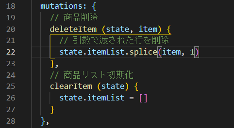
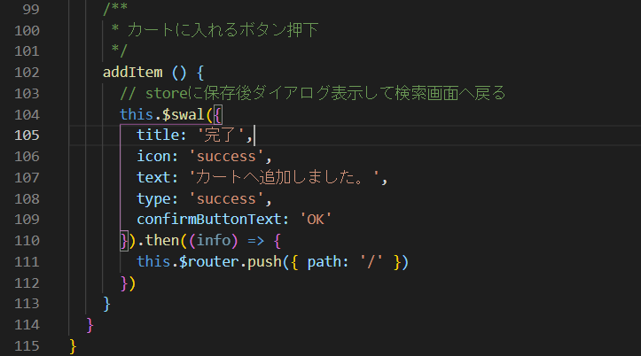

# コード修正(商品情報詳細)

## 修正対象のソース

- src/store/index.js
- src/views/DetailView.vue

続いては商品詳細画面です。

この画面は、検索画面で選択した商品の詳細情報が掲載されています。またこの画面でポイントとなるのは、**商品をカートに入れる機能**です。


## 商品をカートに追加するための機能を実装しよう。

- **src/store/index.js**&emsp;←&emsp;修正するファイル

修正する前に一度、状況を確認してみましょう。  
http://localhost:8080/detail?itemCode=2  
商品の個数を選択して、カートに入れるボタンを押下してみてください。  
「カートに追加しました。」というダイアログが出て、OK ボタンを押下すると検索画面へ戻ります。  

では、この状態でカート画面へ遷移してみましょう。  
http://localhost:8080/cart  
先ほどカートに商品を追加したはずですが、カート画面を開いてみても、何も表示されません。
  
確認できたところで、改めて修正を進めていきましょう。  
<br/>
今回は Vuex というライブラリを使用して、商品をカートに入れます。
"Vuex"とは Vue.js アプリケーションのための 状態管理パターン + ライブラリです。

https://vuex.vuejs.org/ja/ (Vue.js 公式サイトより)

では、実際に修正していきましょう。今回修正する箇所は"src/store/index.js"の"mutations"の箇所です。  
mutations にカートに入れるボタンを押下した際に、商品情報を保持するための処理を追加します。  
src/store フォルダ内の index.js を開き、「mutations」を検索します。

修正前  


修正後

mutations の中に商品追加の処理「pushItem」を追加してください。

```javascript
  mutations: {
    // 商品追加
    pushItem (state, item) {
      // 引数で渡された配列をまるごとpush
      state.itemList.push(item)
    },
    // 商品削除
    deleteItem (state, item) {
      // 引数で渡された行を削除
      state.itemList.splice(item, 1)
    },
    // 商品リスト初期化
    clearItem (state) {
      state.itemList = []
    }
  },
```

pushItem は渡された引数を、itemList という名前のリスト変数に追加します。これで商品情報を保持させることができます。

## カートに入れる機能を追加しよう。

- **src/views/DetailView.vue**&emsp;←&emsp;今回修正するファイル

ここでは、商品検索で選択した商品情報をカートに入れる処理を追加します。
methods の中にある「additem」の処理を下記のように修正してみましょう。  
Ctrl+P(Mac の場合 Command+P)で、「detailView.vue」ファイルを開き、「addItem」を検索します。

修正前  


修正後  
```javascript
    addItem () {
      // storeに保存後ダイアログ表示して検索画面へ戻る
      this.$swal({
        title: '完了',
        icon: 'success',
        text: 'カートへ追加しました。',
        type: 'success',
        confirmButtonText: 'OK'
      }).then((info) => {
        this.$router.push({ path: '/' })
      })
    }
```

addItem の下に商品情報を保持するためのソースを追加してください。

```javascript
    addItem () {
      // storeに保存後ダイアログ表示して検索画面に戻る
      const param = {
        name: this.productName,
        description: this.description,
        price: this.price,
        quantity: Number(this.quantity),
        imageUrl: this.img // 商品画像
      }
      this.$store.commit('pushItem', param)
      // storeに保存後ダイアログ表示して検索画面へ戻る
      this.$swal({
        title: '完了',
        icon: 'success',
        text: 'カートへ追加しました。',
        type: 'success',
        confirmButtonText: 'OK'
      }).then((info) => {
        this.$router.push({ path: '/' })
      })
    }
```

まず画面に表示されている商品のパラメーターをオブジェクト param に設定します。それぞれ商品名・商品説明・値段・数量・商品画像です。

次に先ほど追加した「pushItem」を呼び出して商品情報を store に追加します。  
書き方としては、this.$store.commit('呼び出す処理名',処理に渡す引数)で store の state の値を変更します。  
第一引数を store/index.js の mutations に追加した pushItem にします。  
第二引数は商品情報をもった変数 param にすることで、  
store/index.js の state の itemList に商品情報を追加します。

カート画面では store の保持している itemList を、getters を使用することでカート画面上に表示させています。

## 動作確認

動作確認をしてみましょう。
商品詳細画面内の個数プルダウンで任意の商品数を選択肢し、商品を購入のボタンをクリックしてください。

下記のように完了のダイアログが表示され検索画面に遷移します。  
  
商品がカートに入っているか確認してみましょう。  
画面右上のショッピングカートのアイコンをクリックすることで、カート画面へ遷移します。  
カートに入れた商品が表示されることがわかるかと思います。  


次の手順では、今開いたカート画面のソースコードのリファクタリングを行います！  
商品を何種類かカートへ追加し、カート画面へ遷移しましょう！
