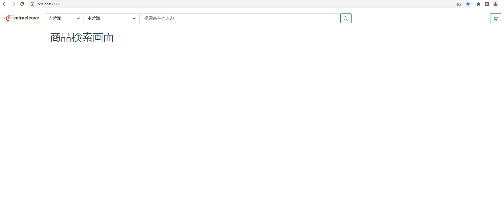

# コード修正(商品検索画面)

当手順では、以下の赤枠部分を実施します。


## 修正対象のソース

- **src\views\ItemSearch.vue**

修正する前に一度、状況を確認してみましょう。

http://localhost:8080/

画面としては、「商品検索画面」と表示されるのみで、商品一覧は検索されていないことがわかります。



確認できたところで、あらためて修正をすすめていきましょう！

## created を使って画面初期表示時の処理を実装しよう。

Ctrl+P(MAC の場合 Command ＋ P) を押下してファイル検索を表示し、「itemSearch.vue」を開く。  
Ctrl ＋ F(MAC の場合 Command+F) で検索欄を表示し、「created」内に初期表示時の処理を記述する。  
今回は、クエリパラメータを受け取って検索処理を行う「search()」を初期表示時に実行するようにしてみます。  
created を以下のように修正してください

変更前

```javascript
  created: function () {
    // 初期表示時処理
  },
```

変更後

```javascript
  created: function () {
    // 初期表示時処理
    this.search()
  },
```

初期表示時に search()メソッドを呼び出すことによって、画面初期表示時に商品一覧の検索処理が行われるようになりました！


大分類、中分類を選択したり、検索ワードを入れて検索ボタンを押下すると、絞り込まれたリストが表示されます。

## created についておさらい

created は画面初期表示時に走る処理です。正確に言うと Vue のインスタンスが生成され､データが初期化された後に実行されます。  
初期表示時に実施したい処理がある場合はこの created に処理をかいていくことで実装することができます。  
今回の場合は画面が初期表示される際に検索処理を行いたかったため、search メソッドを呼び出すように変更しました。  
created は実際の開発でもよく使うライフサイクルフックの一つですので、ぜひ覚えておいてください！

## mounted との違い

created と mounted は共に画面初期表示時に走る処理です。  
mounted は、Vue インスタンスが DOM 要素にマウントされた後に実行される処理です。  
getElementById 等を使って DOM 要素にアクセスをしたい場合は、mounted に書くことが望ましいです。  
created の時に getElementById('hoge')で DOM の要素を取得しようとしても取得することはできません。  
mounted が実行されるタイミングでは DOM の作成が完了しているので DOM の要素が取得できるため  
mounted も、created と並んでよく使うライフサイクルフックです。  
初期表示処理は mounted でまとめて行う、という現場もあります。

---

次の画面では、商品詳細画面の修正を行います！検索結果一覧に表示されている商品画像の何れかをクリックし、商品詳細画面へ移動しましょう！
